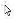
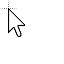
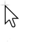
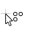
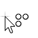
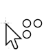
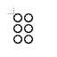

# Kheel Cursors

Copyright (C) 2025 John Mortimore

Released under the [CC BY-NC 4.0](https://creativecommons.org/licenses/by-nc/4.0/) license

## Motivations

* Create a useful tool
* Build upon what Microsoft, Apple, and Xerox have already accomplished
* Have fun

## Design philosophy

The one and only goal of this project is to create a tool that feels organic. In other words, if you weren't told you 
were using a custom set, the idea shouldn't even occur to you. You don't normally think about your cursor; it's just a 
tool that you use. This is a tool, it should not be flashy, it should not draw your attention, it should just work, and 
you shouldn't think about it when you use it.

To this end, the realm of design possibilities is limited in that any radical change to the cursors in use by Microsoft
and Apple today would break the one rule.

## Technical Requirements

This set will not be complete until all the following technical requirements are met:

1. A cursor for all supported roles on Windows 10 and earlier.
2. Each cursor will be available in 32x32, 48x48, 64x64, 96x96, and 128x128 pixels.
3. Designs will be available in both "White with black outline" and "black with white outline" color schemes.
4. Any chiral designs will be available in both left and right-handedness.

## Cursors

Since I am much more accustomed to Windows than Mac, I chose to default to the "white with black outline" color scheme 
that has been the default for Microsoft since Windows 1.0. That said, a version of this set will be available with an
inverted colors scheme.

### Default

I kept the default cursor as an arrow tilted at 22.5°; the angle established by Xerox's Palo Alto Research Center when
they released the Xerox Alto in 1973 and the same angle used today by both Windows and Apple. After 50 years of
dominance, any other shape or angle would feel alien to most computer users.

After many iterations, I ended up with a design that blends features and concepts of the various mice employed by 
Microsoft and Apple over the years. My design has a shorter tail which is in line with every version of Mac since the
Apple System 1.0 and every version of Windows since Windows Vista. Its larger head size is comparable with Windows
Vista and later. It features antialiasing like what was introduced with Windows Vista and macOS 10.4 Tiger. And it 
lacks shadows while using a minimal gradient as seen in Windows 8 and later.

However, unlike Microsoft and Apple, my design features a tail that extends at the same angle as the pointer (22.5°) 
instead of that irregular nonsense they went with. And unlike Windows, my design has a boarder thickness that scales
with the cursor instead of remaining at 1 px.

### Loading

The loading cursors ("busy" and "working in background" in Windows) is the one area with less rigidly established
norms. While almost always animated, these have been represented with a variety of symbols over the years including
spinning disks and rings, hourglasses, and wristwatches, among others. Often, the "working in background" cursor will
feature a shrunken version of the "busy" cursor placed to the side of the default arrow cursor. I wanted to stick to
that design motif, but with a slight variation.

After experimenting with more complex animated designs that always seemed to go against our design philosophy, I 
eventually settled on a rotating dot matrices. The "busy" cursor is a 3x3 grid with a center dot that is always on and
a line of five other dots that cycle around the center. The "working in background" cursor features a proportional 2x2 
grid where a single dot is always off, and it moves around the grid in a circle. I quite like that it matches the motif 
without relying on a scaling transformation.

I experimented with the designs cycling once per second (1 Hz), and that just felt too slow. I think, particularly
when using a fast computer, you want to feel like your PC is doing things fast, especially when you're waiting on it.
And even though there is no connection between your cursor's frequency and your CPU, a fast spinner feels less painful 
to watch than a slow one. So I tried faster speeds and eventually settled on 1.25 Hz as anything faster started to feel
obnoxious.

### Other

Designs for the other roles are in the works but are not yet ready for review.

## Credits

1. The following software was used in the creation of this project:
   1. [RealWorld Cursor Editor](http://www.rw-designer.com/cursor-maker) versions 2013.1 and 2023.1 which are licensed
  under the [RealWorld Cursor Editor license](http://www.rw-designer.com/cursor-license) and are free for both personal
  and commercial use.
   2. [RealWorld Paint](http://www.rw-designer.com/image-editor) version 2013.1 which is licensed under the
    [RealWorld Paint license](http://www.rw-designer.com/paint-donate) and is free for both personal and commercial use.
2. The Kheel logo uses the [Signika Negative](https://www.1001fonts.com/signika-negative-font.html) typeface by
  [Anna Giedryś](https://www.1001fonts.com/users/ancymonic/). Signika Negative is licensed under the
  [SIL Open Font License (OFL)](http://scripts.sil.org/OFL) and is free for both personal and commercial use.

## Works cited
1. de Boar, Michael (November 5, 2018). ***[Mouse Cursor History (and why I made my own)](https://www.youtube.com/watch?v=YThelfB2fvg)*** (Video).
   > Michael (Posy) de Boar's video contains an excellent breakdown on mouse cursor history. 
